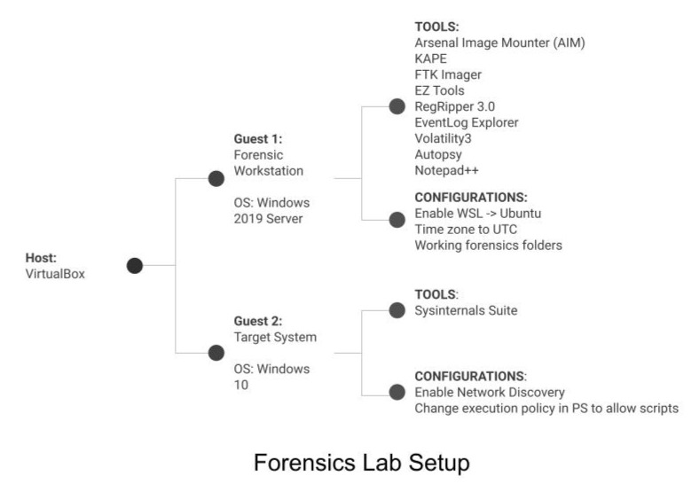

<!--Text can be **bold**, _italic_, ~~strikethrough~~ or `keyword`. -->

**Welcome!**

# Bio

Highly driven cybersecurity enthusiast with an intense curiosity, a passion for problem-solving, and a commitment to lifelong learning. Earned a SANS Cyber Academy scholarship after two years of dedicated self-study. Known for integrity, adaptability, and approaching challenges with insight, patience, and a growth mindset while continuously sharpening skills through home labs, courses, training platforms, and involvement in the cyber community.

# Certifications
- [GIAC Security Essentials Certification (GSEC)](https://www.credly.com/badges/79b72e81-4a43-477e-9333-330d7c2faaac/public_url)

- GIAC Foundational Cybersecurity Technologies (GFACT) -- <div data-iframe-width="150" data-iframe-height="270" data-share-badge-id="fcc07bf5-304c-448e-b31d-41285a98ee5a" data-share-badge-host="https://www.credly.com"></div><script type="text/javascript" async src="//cdn.credly.com/assets/utilities/embed.js"></script>

- ISC2 Certified in Cybersecurity (CC) -- <div data-iframe-width="150" data-iframe-height="270" data-share-badge-id="9c67ac40-1748-4df4-97eb-f5da82538ce2" data-share-badge-host="https://www.credly.com"></div><script type="text/javascript" async src="//cdn.credly.com/assets/utilities/embed.js"></script>

- <iframe src="https://www.credly.com/badges/501dc830-de3d-4c37-bbe7-9dfaf4e0fa9d/public_url" width="150" height="270" frameborder="0"></iframe>

# Projects

## [Cybersecurity Home Lab](./projects/cybersecurity-home-lab.md).

A cybersecurity home lab featuring pfSense for network management, Active Directory with Windows Server, Security Onion for traffic monitoring, and pentesting tools for analysis and exploitation.
  
<!-- > This is a blockquote following a header.
>
> When something is important enough, you do it even if the odds are not in your favor. -->

## [Windows Forensics Home Lab](./projects/windows-forensics-home-lab.md).



- Configured a forensics workstation and target machine, executing scripts to simulate attacks.
- Acquired and analyzed memory dumps and disk images using AIM, KAPE, and FTK Imager.
Investigated registry, file system, program execution, and logs with Zimmerman Tools and RegRipper.
- Performed memory forensics on dumps with Volatility3.

<!-- ### Header 3

```js
// Javascript code with syntax highlighting.
var fun = function lang(l) {
  dateformat.i18n = require('./lang/' + l)
  return true;
}
```

```ruby
# Ruby code with syntax highlighting
GitHubPages::Dependencies.gems.each do |gem, version|
  s.add_dependency(gem, "= #{version}")
end
``` -->

#### Header 4

*   This is an unordered list following a header.
*   This is an unordered list following a header.
*   This is an unordered list following a header.

##### Header 5

1.  This is an ordered list following a header.
2.  This is an ordered list following a header.
3.  This is an ordered list following a header.

###### Header 6

| head1        | head two          | three |
|:-------------|:------------------|:------|
| ok           | good swedish fish | nice  |
| out of stock | good and plenty   | nice  |
| ok           | good `oreos`      | hmm   |
| ok           | good `zoute` drop | yumm  |

### There's a horizontal rule below this.

* * *

### Here is an unordered list:

*   Item foo
*   Item bar
*   Item baz
*   Item zip

### And an ordered list:

1.  Item one
1.  Item two
1.  Item three
1.  Item four

### And a nested list:

- level 1 item
  - level 2 item
  - level 2 item
    - level 3 item
    - level 3 item
- level 1 item
  - level 2 item
  - level 2 item
  - level 2 item
- level 1 item
  - level 2 item
  - level 2 item
- level 1 item

### Small image


### Large image


### Definition lists can be used with HTML syntax.

<dl>
<dt>Name</dt>
<dd>Godzilla</dd>
<dt>Born</dt>
<dd>1952</dd>
<dt>Birthplace</dt>
<dd>Japan</dd>
<dt>Color</dt>
<dd>Green</dd>
</dl>

```
Long, single-line code blocks should not wrap. They should horizontally scroll if they are too long. This line should be long enough to demonstrate this.
```

```
The final element.
```
